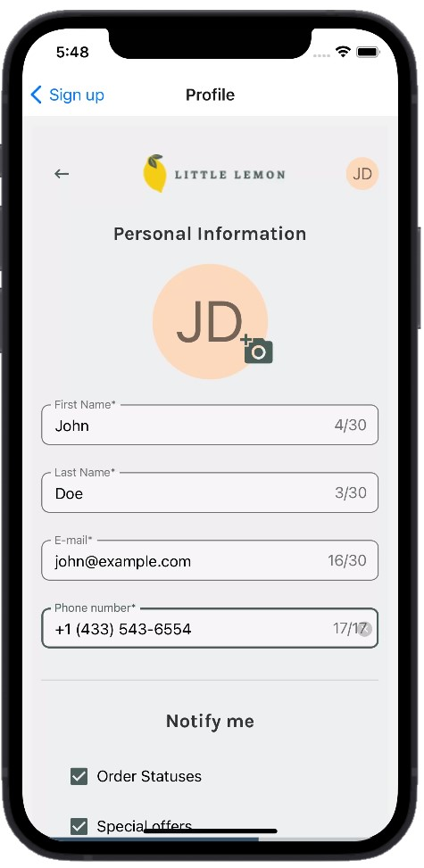
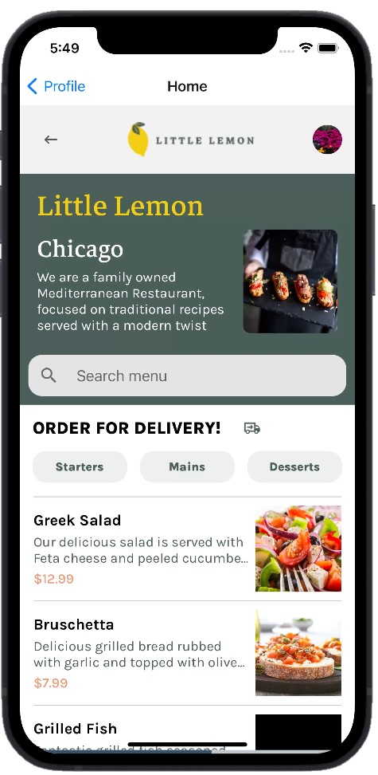

# Restaurant Menu App

The app is developed in React Native by using Expo Snack (SDK 48). User data is stored in Expo SQLite and AsyncStorage.

## Features:

* Two onboarding screens
* Profile screen with possibility to upload a profile photo (or display user initials instead)
* Menu items on the home screen are displayed using section list, menu data is fetched from an external API
* Authentication flow depends on whether the user has completed onboarding

## Suggestions for further improvement

* Adding new features, such as possibility to open each menu item and add it to basket
* Add password authentication
* Improve the visual design and UI in general
* Add more UI animations to enhance the product's look, feel and interactivity

## Screenshots
* Profile screen

* Home screen

If you're having problems, you can tweet to us [@expo](https://twitter.com/expo) or ask in our [forums](https://forums.expo.dev/c/expo-dev-tools/61) or [Discord](https://chat.expo.dev/).

